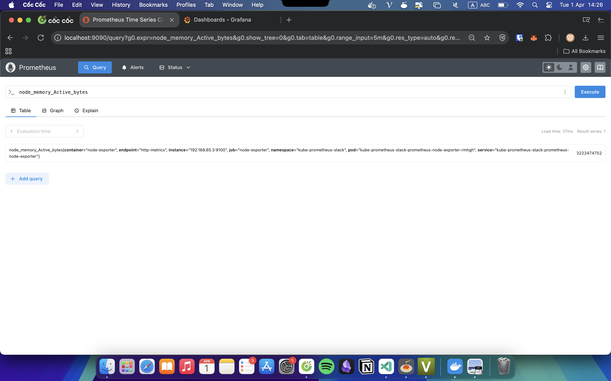
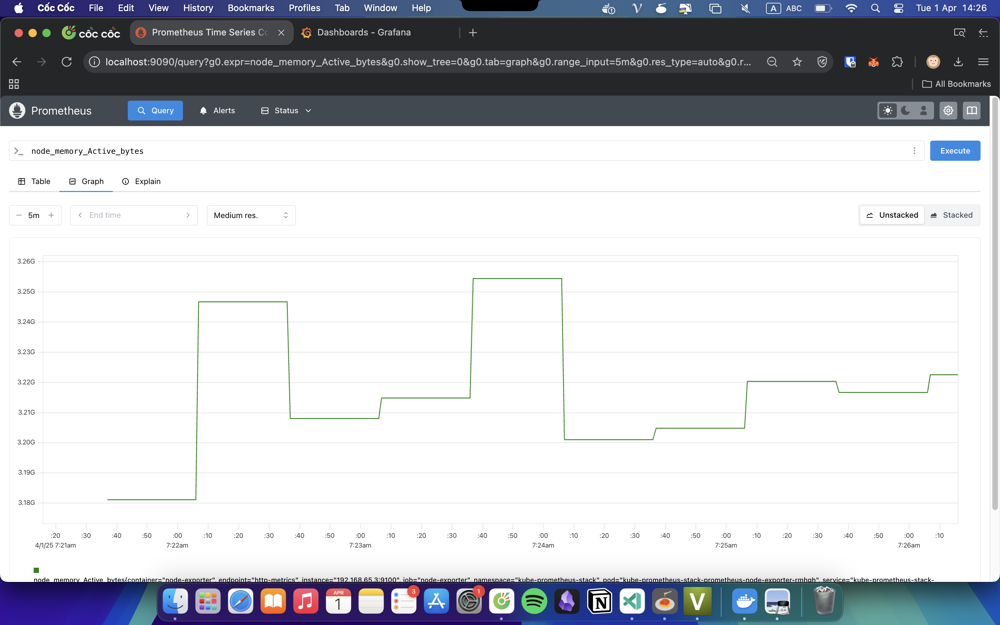
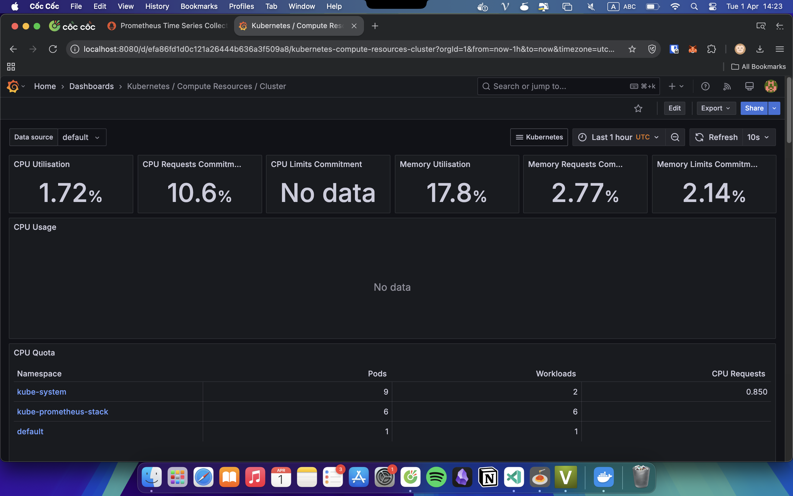
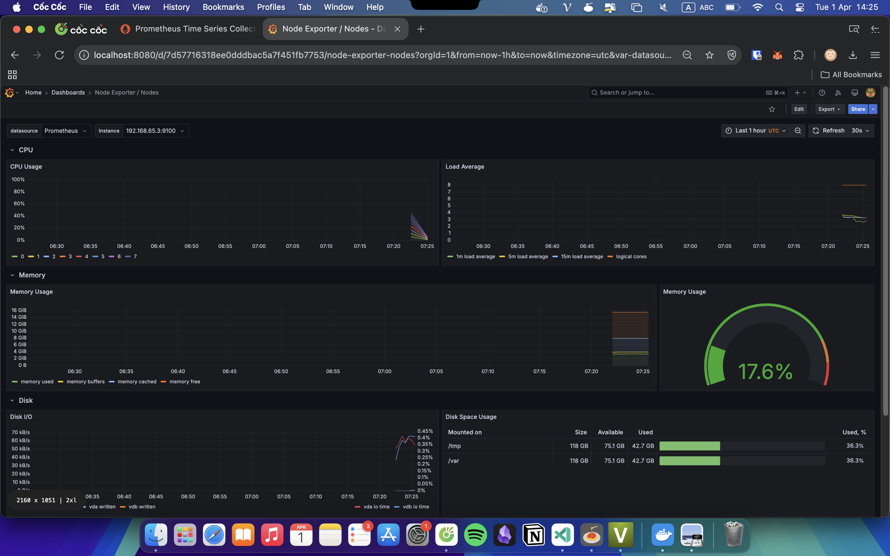
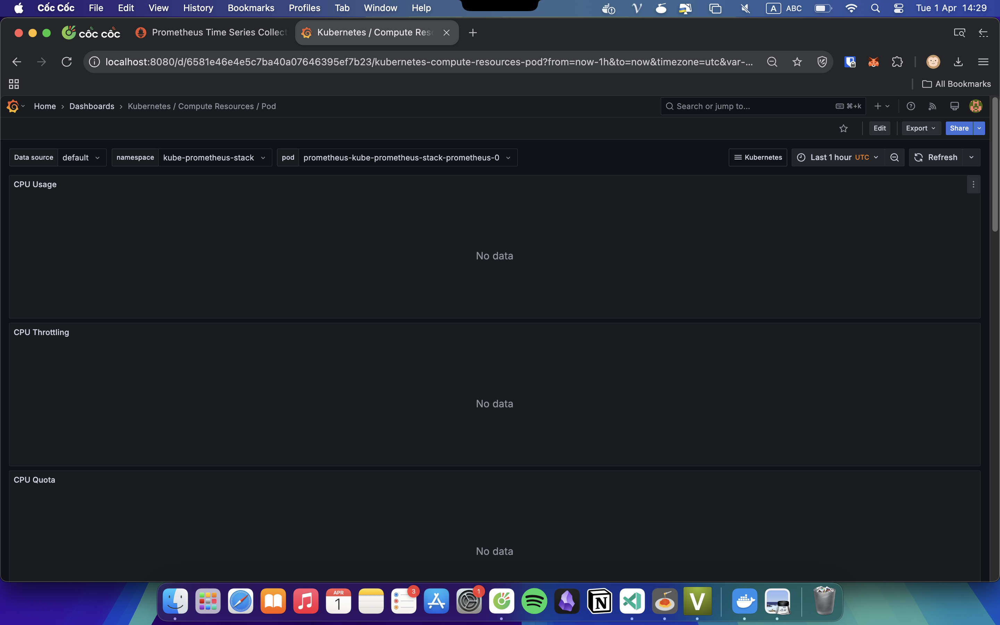
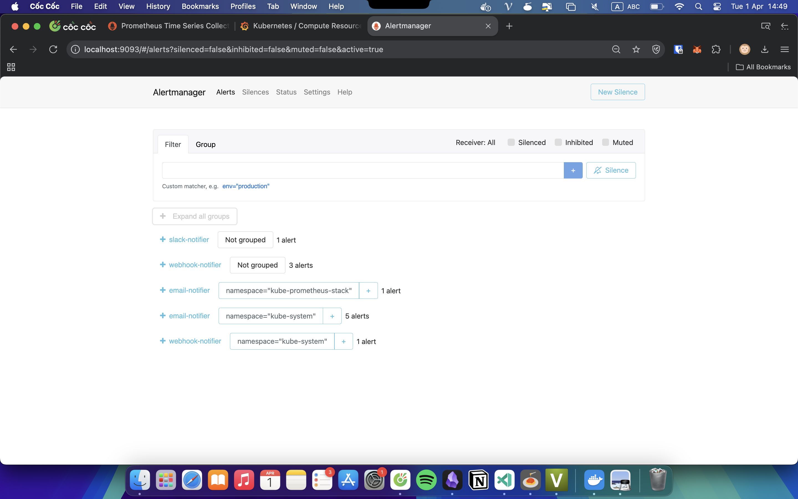
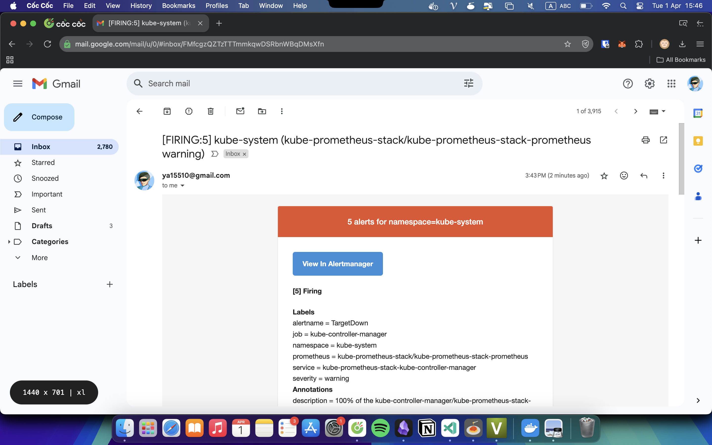
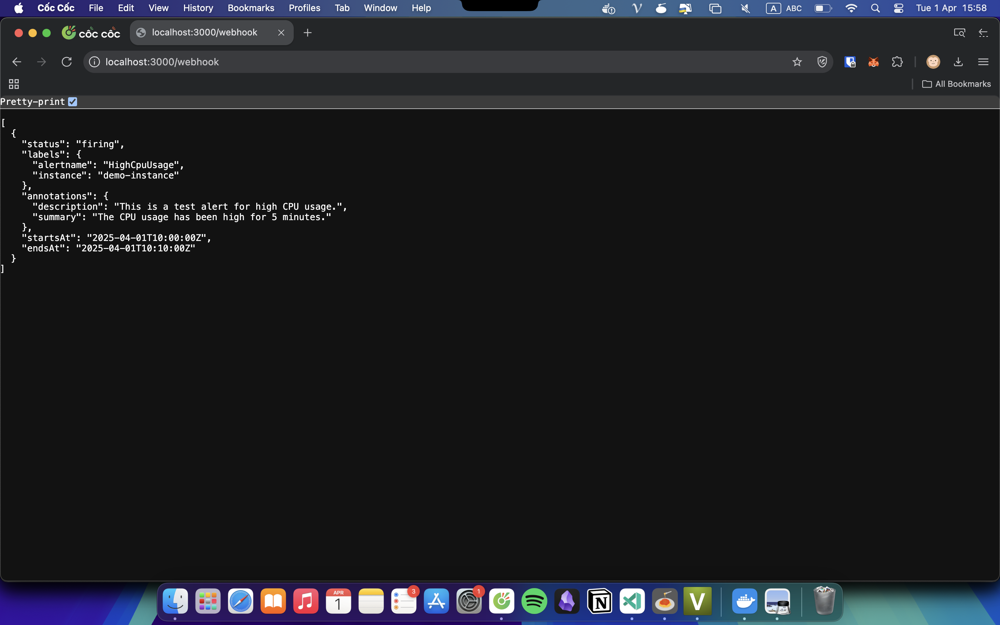
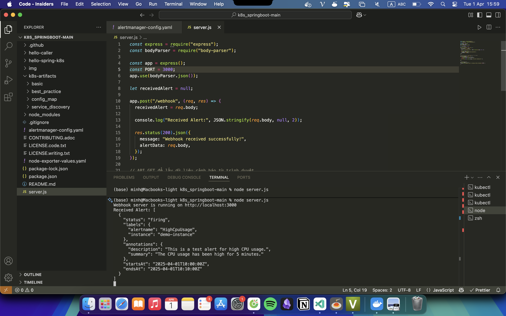

Họ tên: Nguyễn Quang Minh

MSV: 22024547

Deploy the chart into a new namespace:

```bash
helm repo add prometheus-community https://prometheus-community.github.io/helm-charts

helm repo update

helm upgrade kube-prometheus-stack prometheus-community/kube-prometheus-stack -n kube-prometheus-stack -f node-exporter-values.yaml
```

Prometheus for monitering:




Grafana for visualization and dashboards:

Cluster


Node


Pod


Redeploy the Prometheus stack and apply your Alertmanager settings:

```bash
helm upgrade kube-prometheus-stack prometheus-community/kube-prometheus-stack \  -n kube-prometheus-stack \
  --reuse-values \
  -f alertmanager-config.yaml
```

Configure alerts with Alertmanager



Send alert through email



Send alert through Web API




